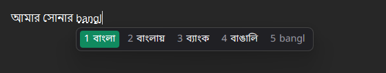
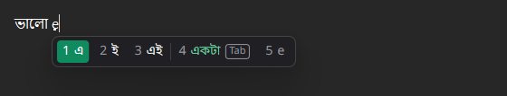
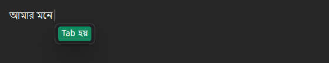
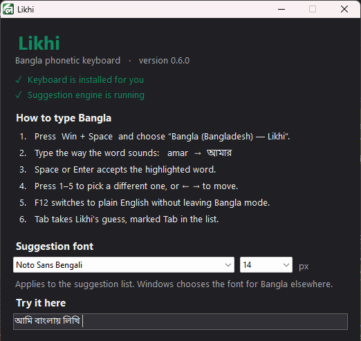

  

<h1 align="center">Likhi (লিখি)</h1>

  <b>Type Bangla the way you type it in chat.</b> 
  চ্যাটে যেভাবে লেখেন, সেভাবেই বাংলা লিখুন।

  

  

Likhi is a free Bangla keyboard for Windows. Type a word the way it sounds, `amar`, `amr` or
`aamar`, and Likhi writes **আমার**. There are no spelling rules to learn and no special keys to
remember. If the first suggestion isn't the word you meant, the right one is usually just below
it, a number key away.

It works everywhere you type: Chrome, Facebook, WhatsApp, Telegram, Word, the Windows search box,
and the rest.

> **Likhi is in its pilot phase.** It already works well for everyday typing, and it gets better
> with every update. Updates arrive automatically.

## Why people like it

- **Type it however you like.** `amar`, `amr`, `aamar` and `AMAR` all give আমার. Likhi
  understands loose spellings, short forms and slang.
- **The right word, spelt correctly.** Chat is full of misspellings, and many keyboards copy them.
  Likhi prefers the correct spelling: on real chat, 97% of its first suggestions are correctly
  spelt.
- **It reads your sentence.** The words you have already typed help Likhi pick the next one, so the
  same letters can give a different word in a different sentence.
- **It guesses the next word.** When Likhi is confident, it offers the word you are about to type,
  marked **Tab**. Press Tab to take it, or just keep typing.
- **English stays English.** What you typed, in English letters, is always the last suggestion, so
  you can mix English words in without switching keyboards.
- **It learns from you.** Pick the same word a few times and Likhi puts it first.
- **Fast and private.** Likhi runs on your own PC and works offline. What you write is never
  uploaded; the one thing that is, during the pilot, is explained under [Your privacy](#your-privacy)
  and turned off in one click.
- **Free and open source.**

   
  Typing the next word: Likhi's guess, <b>একটা</b>, is marked Tab.

   
  After a space: Likhi offers the word that usually comes next. Tab types it.

## Get started

1. **Download** the newest `LikhiSetup` file from the
   [Releases page](https://github.com/KhaledBinAmir/likhi/releases) and open it.
   - If Windows says **"Windows protected your PC"**, click **More info**, then **Run anyway**.
     Windows shows this for programs it doesn't know yet (see the [questions](#questions) below).
   - Windows will ask for permission to install. Likhi needs it once, to add the keyboard.
2. **Switch to Likhi:** press **Win + Space** and choose **Bangla (Bangladesh) — Likhi**.
3. **Type!** Write a word the way it sounds and press **Space**.

Likhi needs Windows 10 (May 2019 update or newer) or Windows 11, 64-bit.

## How to type

| Key | What it does |
|---|---|
| **Space** or **Enter** | Types the highlighted word |
| **1** to **5** | Picks a different suggestion |
| **←** and **→** | Moves between suggestions |
| **Tab** | Takes Likhi's guess, the suggestion marked **Tab** |
| **F12** | Switches to plain English and back, without leaving Likhi |
| **Win + Space** | Switches between Likhi and your other keyboards |

Open **Likhi** from the Start menu to see these tips, try typing, and change the settings: the
suggestion font and size, whether Likhi guesses words, and whether it starts when you sign in.

  

The Likhi icon by the clock lets you open Likhi, check for updates, or exit. If you exit, the
keyboard types plain English until you open Likhi again or sign in next time.

## Your privacy

Likhi sees what you type, as every keyboard does, so here is exactly what happens to it.

- **What you write stays on your PC.** Your messages and documents, and what Likhi learns from
  you, are never uploaded.
- **Usage reporting is on during the pilot**, to help make Likhi better. It sends counts (for
  example, how often the first suggestion was the right one), plus single words where Likhi's first
  suggestion was *wrong*: what you typed, and the word you picked instead. It never sends numbers,
  email addresses, web addresses, or anything typed into a password box.
- **You can turn it off** in one click: open **Likhi** from the Start menu and clear **"Share
  anonymous usage data to improve suggestions"**.

<b>The full details</b>

Likhi is an input method, so it sees everything you type. What it does with that is worth being
exact about.

**Never leaves your machine, ever:** the words you type, the text you produce, and what Likhi learns
from your choices. The personal model is a SQLite database in `%LOCALAPPDATA%\Likhi` and is yours.

**Usage reporting is on by default in the pilot builds**, including the installer attached to the
releases here, and sends two things to a collection endpoint:

- *Counters.* How many words were committed, how often the first suggestion was the one taken, which
  position was chosen, how long suggestions took, how often a next-word suggestion was shown and how
  often it was taken, how often a predicted word was the one taken, and the name of the application.
  No text at all.
- *Struggle words.* **Only when the first suggestion was wrong**: the roman string you typed, the
  word you picked instead, and the word Likhi wrongly put first. A word accepted first time is never
  recorded, because it teaches us nothing.

Before anything is written, it is filtered: anything containing a digit, `@`, `:`, `/` or `\` is
dropped, so identifiers, passwords, times, money and URLs never qualify. Anything longer than 32
characters is dropped, which excludes pasted or concatenated text. A field the application marks
secure, such as a password box, records nothing whatsoever, not even a counter. No timestamp is
finer than the hour, and the machine is identified by a random installation id and nothing else.

**To turn it off:** open **Likhi** from the Start menu and clear **"Share anonymous usage data to
improve suggestions"**. That writes a per-user setting, so it needs no administrator and does not
decide for anyone else sharing the machine. To see exactly what is held before deciding, the files
are plain JSON Lines in `%LOCALAPPDATA%\Likhi` (`metrics.jsonl` and `events.jsonl`) and can be read
in Notepad; deleting them is enough to erase them.

The reason it defaults to on: this is a pilot, and the struggle words are the only honest signal for
which words the engine gets wrong. They become the test set every later change is measured against.
That is a real trade against your privacy, which is why it is written out here rather than buried.

**Update checks.** Once a day Likhi asks GitHub whether a newer release exists. That request carries
nothing about you or what you type, but like any request it tells GitHub that a computer at your
address runs Likhi. It is a separate setting from usage reporting, **"Check for updates once a day"**
in the Likhi window, so switching one off never leaves the other on by accident.

An update is only offered after two checks: the release is signed by a key that never leaves the
publisher's machine, and the installer matches exactly what that signature describes. Anything else
is refused. Nothing installs until you click the notification, and Windows asks for permission.

## Questions

**Windows says "Windows protected your PC". Is Likhi safe?**
That warning appears for programs Windows hasn't seen many people download yet, and Likhi isn't
signed with a paid Windows certificate yet. Click **More info**, then **Run anyway**. Every Likhi
update is checked against our own signature before it is offered, and the code is all here for
anyone to read.

**How do I update?**
You don't need to do anything. Likhi checks once a day and shows a notification when an update is
ready. Click it to install.

**Does it work without the internet?**
Yes. Typing works completely offline. The internet is only used for update checks and, if you leave
it on, usage reporting.

**How do I remove it?**
Open **Settings → Apps → Installed apps**, find **Likhi (Bangla phonetic keyboard)**, and choose
**Uninstall**.

**Something went wrong, or a word keeps coming out wrong?**
Please tell us on the [Issues page](https://github.com/KhaledBinAmir/likhi/issues). Include what you
typed, what you expected, and what you got.

## For developers

Likhi is a Rust engine and Windows text service, with a small C# settings window and an Inno Setup
installer. Building, testing, measuring and releasing are described in
[docs/DEVELOPMENT.md](docs/DEVELOPMENT.md). The plan and research notes are in
[docs/PLAN.md](docs/PLAN.md) and [docs/research](docs/research).

## Credits and licences

Likhi is made by [Khaled Bin Amir](https://github.com/KhaledBinAmir). The logo is by
[Azmain Riad](https://github.com/azmainriad).

Likhi's code is MIT. It builds on open data and models whose licences are respected as follows:

| Resource | License | Use in Likhi |
|---|---|---|
| [Dakshina](https://github.com/google-research-datasets/dakshina) | CC BY-SA 4.0 | evaluation, training; derived data files released under CC BY-SA 4.0 |
| [Aksharantar](https://huggingface.co/datasets/ai4bharat/Aksharantar) | CC0 (mined) / CC-BY (manual) | training |
| [BanglaTLit](https://github.com/farhanishmam/BanglaTLit) | MIT | chat in context: the Likhi model's training, tuning and evaluation |
| [Somoy TV YouTube comments](https://data.mendeley.com/datasets/3c3j3bkxvn/4) | CC BY 4.0 | the Likhi model's training; no comment ships |
| [Avro Phonetic dictionary](https://github.com/OpenBangla/riti) (OpenBangla riti) | MPL-2.0 | the spelling marks: which of the lexicon's own words are correctly spelt; the list does not ship |
| [Hunspell bn_BD](https://github.com/LibreOffice/dictionaries/tree/master/bn_BD) (LibreOffice) | GPL-2.0 | the same, at build time only; the list does not ship |
| [IndicXlit](https://github.com/AI4Bharat/IndicXlit) | MIT | the transliteration model before 0.6.0; the Likhi model keeps its shape |
| [avro.py](https://github.com/hitblast/avro.py) | MIT or Apache-2.0 | the Avro Phonetic rule tables, used as one candidate channel |
| [IndicCorp v2](https://huggingface.co/datasets/ai4bharat/IndicCorpV2) | CC0 | word frequencies, language model |
| [FrequencyWords](https://github.com/hermitdave/FrequencyWords) (OpenSubtitles) | CC BY-SA 4.0 | conversational word frequencies |
| Bengali Wikipedia | CC BY-SA | the Likhi model's training, word frequencies |

The Likhi model's weights are released under CC BY-SA 4.0, the strongest term of the data it learnt
from; everything that ships, with its source, is listed in [THIRD-PARTY.md](THIRD-PARTY.md).

Likhi is not affiliated with Avro Keyboard, OmicronLab, OpenBangla, LibreOffice, Somoy TV,
AI4Bharat, Google, or Microsoft.

## License

MIT. See [LICENSE](LICENSE).
